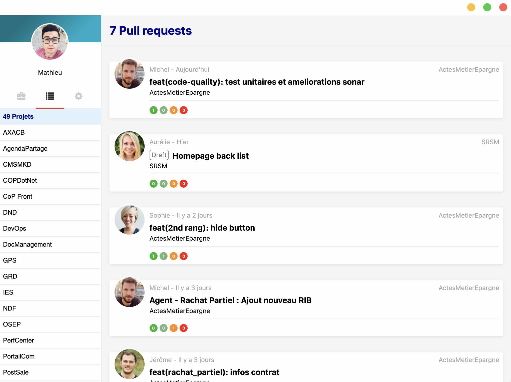

# Skizzle


[](https://github.com/AxaGuilDEv/skizzle/releases)

Skizzle is a Svelte + Electron application fetch and group the pull requests from all your projects from Azure DevOps. Skizzle notify you when a new pull request is available.

This app uses the [Azure DevOps API](https://docs.microsoft.com/en-us/rest/api/azure/devops/?view=azure-devops-rest-5.1) API, and it is built with [Electron](https://electronjs.org/) and [Svelte](https://svelte.dev).

<p align="center">
  
</p>

## Getting Started

Clone this repository:

```bash
# download
git clone https://github.com/AxaGuilDEv/skizzle.git
cd Skizzle

# install dependencies
npm install

# Run project
npm start
```

### Installing

Installing Skizzle is pretty basic. Just follow the installer.
For logging into the app, you have to use your Azure devOps account.

## Contributing

Please read [CONTRIBUTING.md](CONTRIBUTING.md) for details on our [code of conduct](CODE_OF_CONDUCT.md), and the process for submitting pull requests to us.

## Authors

BOUKORRAS Jerome - Software Engineer.
DE BAERDEMAEKER Mathieu - Software Engineer.

## License

This project is licensed under MIT License - see the [LICENSE.md](LICENSE.md) file for details
